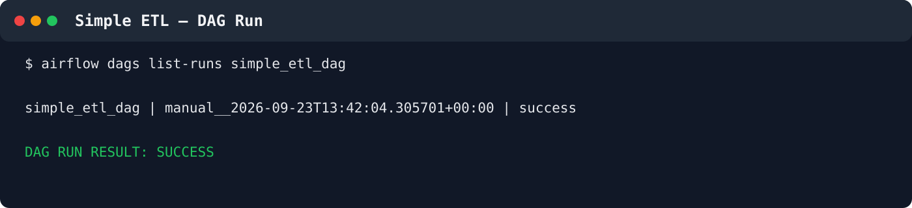
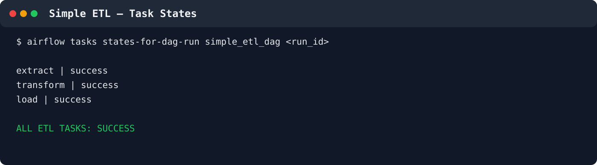
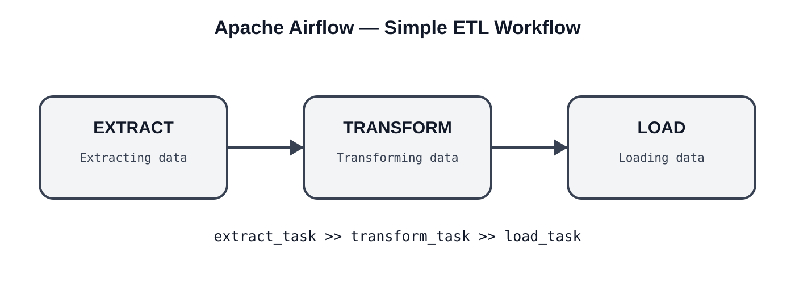
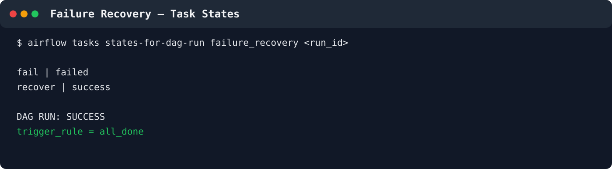
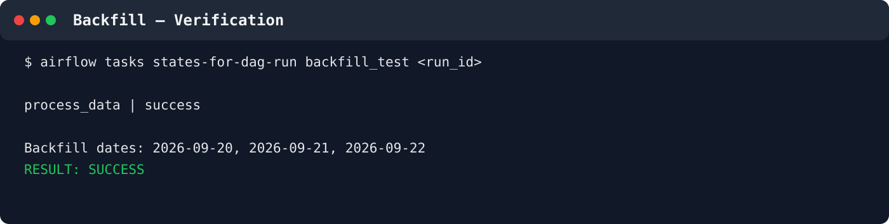

# Apache Airflow Setup & Practice

A practical Apache Airflow learning repository documenting the setup, concepts, DAG development, debugging, execution, and verification completed during the practice sessions.

## Environment

| Component | Version / Configuration |
|---|---|
| Apache Airflow | 3.3.2 |
| Python | 3.11.x |
| OS | Ubuntu / Linux |
| Airflow mode | `airflow standalone` |
| AIRFLOW_HOME | `~/airflow` |
| DAG folder | `~/airflow/dags` |
| Web UI / API | `http://localhost:8080` |
| Executor | LocalExecutor |

---

## 1. Airflow Setup

Airflow was installed in a Python virtual environment and run locally using:

```bash
airflow standalone
```

The scheduler and DAG processor were verified during troubleshooting with:

```bash
airflow jobs check --job-type SchedulerJob
airflow jobs check --job-type DagProcessorJob
```

Example verification:

```
Found one alive job.
```

---

# 2. Core Concepts Practiced

- DAG creation and registration
- PythonOperator
- Task dependencies
- Manual DAG triggering
- Scheduling and cron expressions
- Retries
- Task timeouts
- BashOperator
- Variables
- Connections
- Sensors
- Branching
- Dynamic Task Mapping
- TaskFlow API
- Jinja templating
- Logical dates and data intervals
- Trigger rules
- Task Groups
- Callbacks
- Task testing and debugging
- Pools and task concurrency
- Backfill
- Rerun
- Failure handling and recovery
- Simple ETL workflow

---

# 3. DAG Practice Files

## 3.1 Hello Airflow

File:

```
dags/hello_airflow.py
```

Basic PythonOperator DAG that executes a simple Python function.

## 3.2 Task Dependencies

File:

```
dags/dependency_demo.py
```

Workflow:

```
start
  ↓
process
  ↓
finish
```

Verified with:

```bash
airflow dags show dependency_demo
```

Graph:

```
start -> process -> finish
```

## 3.3 Backfill and Rerun

File:

```
dags/backfill_test.py
```

Backfill dates:

- 2026-09-20
- 2026-09-21
- 2026-09-22

Verified task output:

```
process_data | success
```

## 3.4 Failure Handling and Recovery

File:

```
dags/failure_recovery.py
```

The DAG intentionally raises:

```python
raise ValueError("Intentional failure for testing")
```

Recovery uses:

```python
trigger_rule="all_done"
```

Final task states:

```
fail     | failed
recover  | success
```

The DAG run itself completed successfully.

## 3.5 Simple ETL

File:

```
dags/simple_etl_dag.py
```

This was the final practical exercise.

### ETL pipeline

```
EXTRACT
   ↓
TRANSFORM
   ↓
LOAD
```

Implementation:

```python
extract_task >> transform_task >> load_task
```

The DAG was registered, unpaused, triggered, and verified.

Final task states:

```
extract   | success
transform | success
load       | success
```

---

# 4. Verified Output Visuals

The repository includes visual output cards generated directly from the **verified terminal results recorded during the practice session**. They are documentation visuals, not screenshots captured from the terminal UI.

### Simple ETL — DAG Run



### Simple ETL — Task States



### Simple ETL Workflow



### Failure Recovery



### Backfill Verification



For the complete command/output record, see [`docs/airflow_practical_outputs.md`](docs/airflow_practical_outputs.md).

---

# 5. Important Commands

List DAGs:

```bash
airflow dags list
```

Check import errors:

```bash
airflow dags list-import-errors
```

Show a DAG graph:

```bash
airflow dags show <dag_id>
```

Trigger a DAG:

```bash
airflow dags trigger <dag_id>
```

List DAG runs:

```bash
airflow dags list-runs <dag_id>
```

Check task states:

```bash
airflow tasks states-for-dag-run <dag_id> <run_id>
```

Pause/unpause:

```bash
airflow dags pause <dag_id>
airflow dags unpause <dag_id>
```

Check scheduler:

```bash
airflow jobs check --job-type SchedulerJob
```

Check DAG processor:

```bash
airflow jobs check --job-type DagProcessorJob
```

---

# 6. Troubleshooting Performed

During practice, real Airflow troubleshooting situations were handled.

### DAG not appearing

Checked:

```bash
ls -l ~/airflow/dags/<dag_file>.py
airflow dags list-import-errors
airflow jobs check --job-type DagProcessorJob
```

When required, the DAG processor and standalone Airflow service were restarted.

### DAG run stuck in queued state

Checked:

- DAG pause state
- Scheduler health
- DAG processor health
- Executor configuration
- Task states

A paused `failure_recovery` DAG was identified and unpaused. The queued run then completed successfully.

---

# 7. Repository Structure

```
Apache_airflow_setup_practice/
│
├── README.md
├── docs/
│   ├── airflow_practical_outputs.md
│   └── screenshots/
│       ├── simple_etl_run.svg
│       ├── simple_etl_tasks.svg
│       ├── simple_etl_workflow.svg
│       ├── failure_recovery.svg
│       └── backfill.svg
│
└── dags/
    ├── hello_airflow.py
    ├── dependency_demo.py
    ├── backfill_test.py
    ├── failure_recovery.py
    └── simple_etl_dag.py
```

---

# 8. Learning Status

The supplied Airflow practical material was completed through the final Simple ETL exercise.

Additional concepts practiced beyond the basic PDF material include:

- XCom
- Variables
- Connections
- Sensors
- Branching
- Dynamic Task Mapping
- TaskFlow API
- Jinja templating
- Logical Dates
- Trigger Rules
- Task Groups
- Callbacks
- Debugging
- Pools
- Backfill/Rerun
- Failure Recovery

## Final verified results

```
dependency_demo   -> SUCCESS
backfill_test     -> SUCCESS
failure_recovery  -> SUCCESS
simple_etl_dag    -> SUCCESS
```

All documented DAGs were developed and verified locally with Apache Airflow 3.3.2.
